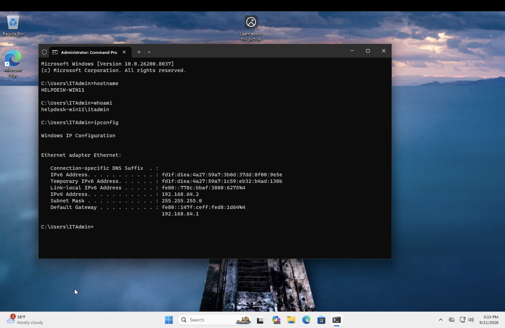

# Windows 11 Workstation Deployment

## Objective

Deploy and configure a Windows 11 Pro virtual workstation that will serve as the first endpoint in my IT Help Desk home lab.

## Environment

- Host OS: macOS
- Virtualization Platform: UTM
- Guest OS: Windows 11 Pro ARM64
- Workstation Name: HELPDESK-WIN11
- Administrator Account: `ITAdmin`
- Virtual Disk: 64 GB

## Deployment Process

1. Created a new Windows virtual machine in UTM.
2. Attached a Windows 11 ARM64 installation ISO.
3. Configured virtual CPU, memory, storage, and networking.
4. Installed Windows 11 Pro.
5. Created the local `ITAdmin` administrator account.
6. Installed UTM Guest Tools for virtual hardware integration.
7. Renamed the workstation to `HELPDESK-WIN11`.
8. Restarted the workstation and verified the configuration.

## Troubleshooting Encountered

### Virtual Disk Size

During Windows installation, the virtual disk was initially too small to meet the Windows 11 storage requirement.

I identified the virtual NVMe system disk in UTM and increased its capacity to 64 GB. After resizing the correct virtual disk, Windows Setup recognized the available storage and the installation completed successfully.

### PowerShell Syntax

While renaming the computer, I initially encountered a PowerShell parameter error due to incorrect command syntax.

After reviewing and correcting the command, I successfully renamed the workstation:

`Rename-Computer -NewName "HELPDESK-WIN11" -Restart`

## Verification

After deployment, I used Windows command-line tools to verify the system configuration.

### Computer Name

Command:

`hostname`

Result:

`HELPDESK-WIN11`

### Logged-In User

Command:

`whoami`

Result:

`helpdesk-win11\itadmin`

### Network Configuration

Command:

`ipconfig`

I used `ipconfig` to identify the workstation's IPv4 address, subnet mask, and default gateway.

## Skills Demonstrated

- Virtual machine deployment
- Windows 11 installation and configuration
- Virtual disk management
- Windows local administration
- Basic PowerShell
- Windows Command Prompt
- Basic TCP/IP networking
- Troubleshooting and configuration verification

## Evidence

### Workstation Identity and Network Verification

The following screenshot verifies the configured workstation name, logged-in administrator account, and TCP/IP configuration.

**Verified configuration:**
- Hostname: `HELPDESK-WIN11`
- Logged-in account: `helpdesk-win11\itadmin`
- IPv4 address: `192.168.64.2`
- Subnet mask: `255.255.255.0`
- Default gateway: `192.168.64.1`
